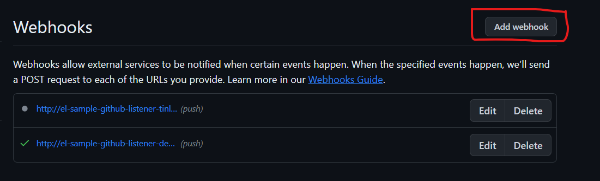

## CI/CD Plan for RedHat OpenShift Dedicated Sandbox with Tekton


### Prerequisites:

1. An active RedHat OpenShift Dedicated Sandbox environment.
2. Tekton Pipelines installed in your OpenShift cluster.
3. A GitHub repository to store your application and pipeline configuration.

### Step 0: Create Secret

Need to create Secret for accessing sonarqube and azure container registry.

#### Sonarqube Secret 

```oc
oc create secret generic sonar-token --from-literal=SONAR_TOKEN=<Paste the Given password> 
```

Remove <> suppose to look like this --from-literal=SONAR_TOKEN=1123897945792134

#### Azure Container Registry Secret

```oc
oc create secret generic docker-creds --from-literal=DOCKER_PASSWORD=<Paste the Given password> 
```

Remove <> suppose to look like this --from-literal=DOCKER_PASSWORD=1123897945792134

### Step 1: Setting up Storage Reference

Before we begin the pipeline, we need storage for our pipeline's workspaces. Here's a Persistent Volume Claim (PVC) that can be used:

```yaml
# Storage Configuration
kind: PersistentVolumeClaim
apiVersion: v1
metadata:
  name: pvc01
  namespace: tinlam2-dev
spec:
  accessModes:
    - ReadWriteOnce
  resources:
    requests:
      storage: 2Gi
  volumeName: pvc-33bf365f-ea52-411a-9d0a-673aaea645e0
  storageClassName: gp2
  volumeMode: Filesystem
status:
  phase: Bound
  accessModes:
    - ReadWriteOnce
  capacity:
    storage: 2Gi
```

Apply this PVC configuration to your OpenShift environment:

```bash
oc apply -f https://raw.githubusercontent.com/shanmu-ss/sample-spring-kotlin-microservice-cicd/master/yaml/storage.yaml
```

### Step 2: Define the Tekton Tasks Reference:

Tasks define a series of steps to execute. We will need several tasks for our CI/CD pipeline, such as cloning the repository, running tests, scanning the code with SonarQube, and building & pushing the container image.

#### 1. SonarQube Scanner Task Reference:

```yaml
# SonarQube Scanner Task
apiVersion: tekton.dev/v1beta1
kind: Task
metadata:
  name: sonarqube-scanner
  namespace: tinlam2-dev
spec:
  description: >-
    The following task can be used to perform static analysis on the source code
    provided the SonarQube server is hosted

    SonarQube is the leading tool for continuously inspecting the Code Quality
    and Security of your codebases, all while empowering development teams.
    Analyze over 25 popular programming languages including C#, VB.Net,
    JavaScript, TypeScript and C++. It detects bugs, vulnerabilities and code
    smells across project branches and pull requests.
  params:
    - default: ''
      description: Host URL where the sonarqube server is running
      name: SONAR_HOST_URL
      type: string
    - default: ''
      description: Project's unique key
      name: SONAR_PROJECT_KEY
      type: string
  steps:
    - command:
        - /bin/sh
        - '-c'
        - |
          echo "sonar.login=$SONAR_TOKEN" >> sonar-project.properties
          sonar-scanner
      env:
        - name: SONAR_TOKEN
          valueFrom:
            secretKeyRef:
              key: SONAR_TOKEN
              name: sonar-token
      image: 'docker.io/sonarsource/sonar-scanner-cli:4.8.1'
      name: sonar-scan
      resources: {}
      workingDir: $(workspaces.source-dir.path)
  workspaces:
    - name: source-dir
    - name: sonar-settings
```

Apply these tasks to your OpenShift environment:

```bash
oc apply -f https://raw.githubusercontent.com/shanmu-ss/sample-spring-kotlin-microservice-cicd/master/yaml/sonarqube.yaml
```

#### 2. Get Maven Project Version Task Reference:

```yaml
# Maven Get Project Version Task
apiVersion: tekton.dev/v1beta1
kind: Task
metadata:
  name: maven-get-project-version
  namespace: tinlam2-dev
spec:
  params:
    - default: >-
        gcr.io/cloud-builders/mvn@sha256:57523fc43394d6d9d2414ee8d1c85ed7a13460cbb268c3cd16d28cfb3859e641
      description: Maven base image
      name: MAVEN_IMAGE
      type: string
    - default: .
      description: >-
        The context directory within the repository for sources on which we want
        to execute maven goals.
      name: CONTEXT_DIR
      type: string
  results:
    - description: Project version read from pom.xml
      name: version
      type: string
  steps:
    - image: $(params.MAVEN_IMAGE)
      name: mvn-command
      resources: {}
      script: >
        #!/usr/bin/env bash

        VERSION=$(/usr/bin/mvn help:evaluate -Dexpression=project.version -q
        -DforceStdout)

        echo -n $VERSION | tee $(results.version.path)
      workingDir: $(workspaces.source.path)/$(params.CONTEXT_DIR)
  workspaces:
    - name: source
```

Apply these tasks to your OpenShift environment:

```bash
oc apply -f https://raw.githubusercontent.com/shanmu-ss/sample-spring-kotlin-microservice-cicd/master/yaml/mavenversion.yaml
```

#### 3. Build and Push Image Task Reference:

```yaml
# Jib Maven Build and Push Task
apiVersion: tekton.dev/v1beta1
kind: Task
metadata:
  name: jib-maven-task
  namespace: tinlam2-dev
spec:
  description: >-
    This Task builds Java/Kotlin/Groovy/Scala source into a container image
    using Google's Jib tool.

    Jib works with Maven and Gradle projects, and this template is for Maven
    projects.
  params:
    - description: Name of the image to build
      name: IMAGE
      type: string
    - default: >-
        registry.redhat.io/ubi8/openjdk-17@sha256:923b18a62d892ec23b6bbf714ecb237a0a0fa3cd225fbf89d39966dd8d421c72
      description: Maven base image
      name: MAVEN_IMAGE
      type: string
    - default: .
      description: 'The directory containing the app, relative to the source repository root'
      name: DIRECTORY
      type: string
    - default: empty-dir-volume
      description: The name of the volume for caching Maven artifacts and base image layers
      name: CACHE
      type: string
    - default: 'false'
      description: Whether to allow insecure registry
      name: INSECUREREGISTRY
      type: string
    - default: service-ca.crt
      description: CA cert file name for insecure registry service
      name: CACERTFILE
      type: string
    - description: docker username
      name: DOCKER_USERNAME
      type: string
  results:
    - description: Digest of the image just built.
      name: IMAGE_DIGEST
      type: string
  steps:
    - env:
        - name: HOME
          value: /workspace
        - name: DOCKER_CONFIG
          value: $(credentials.path)/.docker/
        - name: DOCKER_PASSWORD
          valueFrom:
            secretKeyRef:
              key: DOCKER_PASSWORD
              name: docker-creds
      image: $(params.MAVEN_IMAGE)
      name: build-and-push
      resources: {}
      script: |
        #!/bin/bash

        # Delete the truststore created on exit
        function cleanup {
          rm $(workspaces.source.path)/truststore.jks
        }

        certParams=""

        if [[ -f /tekton-custom-certs/$(params.CACERTFILE) ]]; then
          # create the truststore with existing certs available
          keytool -importkeystore -srckeystore $JAVA_HOME/lib/security/cacerts -srcstoretype JKS -destkeystore $(workspaces.source.path)/truststore.jks -storepass "changeit" -srcstorepass "changeit" > /tmp/logs 2>&1
          if [ $? -ne 0 ]; then
            cat /tmp/logs
            exit 1
          fi
          # add your certs to the new truststore created
          keytool -import -keystore $(workspaces.source.path)/truststore.jks -storepass "changeit" -file /tekton-custom-certs/$(params.CACERTFILE) -noprompt
          # pass truststore details to the mvn command
          certParams="-Djavax.net.ssl.trustStore=$(workspaces.source.path)/truststore.jks -Djavax.net.ssl.trustStorePassword=changeit"
          # clean truststore on exit
          trap cleanup EXIT
        fi

        mvn -B \
          -Duser.home=$HOME \
          -Djib.allowInsecureRegistries=$(params.INSECUREREGISTRY) \
          -Djib.to.image=$(params.IMAGE) \
          -Djib.to.auth.username=$(params.DOCKER_USERNAME) \
          -Djib.to.auth.password=$DOCKER_PASSWORD \
          $certParams \
          compile \
          com.google.cloud.tools:jib-maven-plugin:build
      securityContext:
        runAsUser: 0
      volumeMounts:
        - mountPath: /workspace/.m2
          name: $(params.CACHE)
          subPath: m2-cache
        - mountPath: /workspace/.cache
          name: $(params.CACHE)
          subPath: jib-cache
      workingDir: $(workspaces.source.path)/$(params.DIRECTORY)
    - image: $(params.MAVEN_IMAGE)
      name: digest-to-results
      resources: {}
      script: >-
        cat
        $(workspaces.source.path)/$(params.DIRECTORY)/target/jib-image.digest |
        tee $(results.IMAGE_DIGEST.path)
  volumes:
    - emptyDir: {}
      name: empty-dir-volume
  workspaces:
    - name: source
    - mountPath: /tekton-custom-certs
      name: sslcertdir
      optional: true
```

Apply these tasks to your OpenShift environment:

```bash
oc apply -f https://raw.githubusercontent.com/shanmu-ss/sample-spring-kotlin-microservice-cicd/master/yaml/buildandpush.yaml
```

### Step 3: Define the Pipeline

The pipeline defines the flow of our CI/CD process, stitching together the tasks in a sequence.

```yaml
# CI/CD Pipeline Definition
apiVersion: tekton.dev/v1beta1
kind: Pipeline
metadata:
  name: sample-java-pipeline
  namespace: tinlam2-dev
spec:
  tasks:
    - name: git-clone
      params:
        - name: url
          value: >-
            https://github.com/shanmu-ss/sample-spring-kotlin-microservice-cicd.git
        - name: revision
          value: master
      taskRef:
        kind: ClusterTask
        name: git-clone
      workspaces:
        - name: output
          workspace: source-dir
    - name: junit-tests
      params:
        - name: GOALS
          value:
            - test
      runAfter:
        - git-clone
      taskRef:
        kind: ClusterTask
        name: maven
      workspaces:
        - name: source
          workspace: source-dir
        - name: maven-settings
          workspace: source-dir
    - name: get-version
      runAfter:
        - sonarqube
      taskRef:
        kind: Task
        name: maven-get-project-version
      workspaces:
        - name: source
          workspace: source-dir
    - name: sonarqube
      params:
        - name: SONAR_HOST_URL
          value: 'https://sonarcloud.io'
        - name: SONAR_PROJECT_KEY
          value: shanmu-ss_sample-spring-kotlin-microservice-cicd
      runAfter:
        - junit-tests
      taskRef:
        kind: Task
        name: sonarqube-scanner
      workspaces:
        - name: source-dir
          workspace: source-dir
        - name: sonar-settings
          workspace: sonar-settings
    - name: build-and-push-image
      params:
        - name: IMAGE
          value: >-
            ragreg.azurecr.io/ragreg/spring-kotlin:$(tasks.get-version.results.version)
        - name: DOCKER_USERNAME
          value: ragreg
      runAfter:
        - get-version
      taskRef:
        kind: Task
        name: jib-maven-task
      workspaces:
        - name: source
          workspace: source-dir
  workspaces:
    - name: source-dir
    - name: sonar-settings
```

Apply this pipeline to your OpenShift environment:

```bash
oc apply -f https://raw.githubusercontent.com/shanmu-ss/sample-spring-kotlin-microservice-cicd/master/yaml/cicdpipeline.yaml
```

### step : Setting Up trigger

#### Trigger-template

```bash
oc apply -f https://raw.githubusercontent.com/shanmu-ss/sample-spring-kotlin-microservice-cicd/master/yaml/triggertemplate.yaml
```

#### eventlisterner

```bash
oc apply -f https://raw.githubusercontent.com/shanmu-ss/sample-spring-kotlin-microservice-cicd/master/yaml/eventlistener.yaml
```

#### Use this commands to find webhoot url 

```
$ oc get svc
```

##### Output:
```
NAME                                  TYPE        CLUSTER-IP     EXTERNAL-IP   PORT(S)    AGE
el-sample-github-listener             ClusterIP   172.30.88.73   <none>        8080/TCP   2d1h
```
```
$ oc expose svc el-sample-github-listener
$ oc get route
```
##### Output
```
NAME         HOST/PORT                                                             PATH   SERVICES       
                PORT            TERMINATION   WILDCARD
el-example   el-sample-github-listener-piotr-cicd.apps.qyt1tahi.eastus.aroapp.io          el-sample-github-listener   http-listener                 None
```

### Github webhook addition:

Go to github Repository where trigger need to be configured. 

- In Github repo, click **Setting** and look for webhook


- Move to webhook addition page and Click webhook addition button



- Fetch the url returned from oc get route and the space with prifix **http://** like this 
**http://el-sample-github-listener-piotr-cicd.apps.qyt1tahi.eastus.aroapp.io** 


### Step 4: Execute the Pipeline

Now, you can start the pipeline, by commit github repo. if push/update any code in the repo. pipeline will trigger

---

**Note**: Ensure you have the necessary secrets and service accounts configured for tasks that require authentication, like pushing images to a container registry or accessing SonarQube. And make sure to remove namespace parameter and change them depends on environment.
